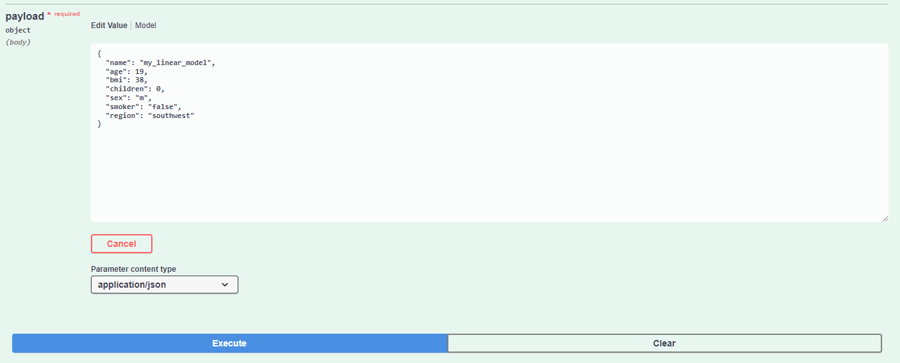

# mlops_ftiad

Сервис поддерживает управлением регрессиоными моделями для предсказания стоимости медицинской страховки по ряду признаков. Сервис дает возможность добавлять модели с заданными параметрами, а также обучать их, тестировать и сохранять. Взаимодействие с HTTP сервисом реализовано с помощью API REST:

POST /models/add: Добавляет новую модель указанного типа (linear/gradboost) с указанными гиперпараметрами.

GET /models/list: Возвращает информацию о запущенных моделях, их имена и соответствующий статус (обучена/необучена) с метриками на обучающей и теститовой выборке.

GET /models/train: Запускает обучение модели, с указанными именем на указанном датасете. Фиксирует метрику качества модели на данном датасете и сохраняет значение.

GET /models/train: Запускает тестирование модели, с указанными именем на указанном датасете. Фиксирует метрику качества модели на данном датасете и сохраняет значение.

POST /models/predict: Запускает предсказание модели на указанных данных.

DELETE /models/remove: Удаляет модель, с указанными именем.

Каждый метод имеет документацию, описывающую правила ввода входных данных и список возможных кодов ответа метода.

## Пример

Мы хотим выполнить предсказание на модели типа "linear", которую добавили ранее с помощью `POST /models/add` под именем "my_linear_model" и обучили с помощью `GET /models/train`

Получаем следующий ответ, содержащий предсказанное моделью значение:

Если же мы не обучали модель, то мы получим ответ следующего содержания:

## Запуск HTTP сервиса:

1. `cd hw1` - переходим в папку hw1 (или hw2)

2. `poetry install` - устанавливаем зависимости
 
3. `poetry run python app.py` - запускаем приложение

4. перейти по предложенной ссылке сервиса: http://127.0.0.1:5000

## Запуск через Docker

1. `cd hw2`
2. `docker-compose build` - собираем образ
3. `docker-compose up` - запускаем образ

## Датасет

Сервис использует датасет [Medical Cost Personal Datasets](https://www.kaggle.com/datasets/mirichoi0218/insurance). В датасете представлены данные о клиентах компании, представляющей медицинское страхование в США. Данны следующие признаки, описывающие клиентат:

age: возраст

sex: пол

bmi: индекс массы тела

children: кол-во детей

smoker: наличие привычки курения

region: район проживания

charges: стоимость страхования
